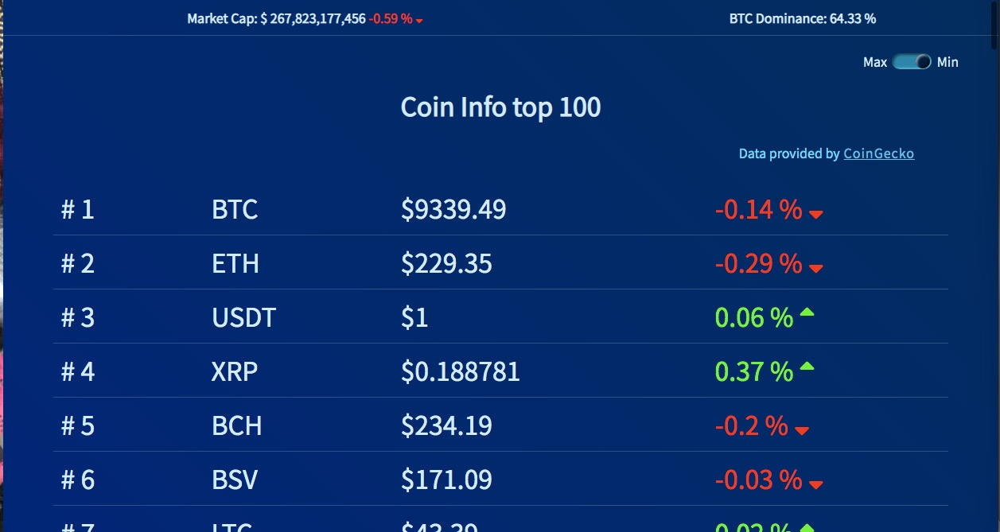
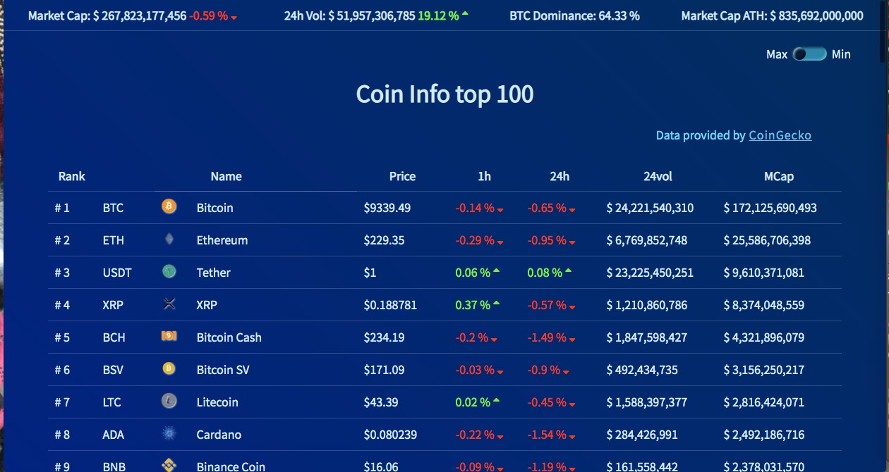
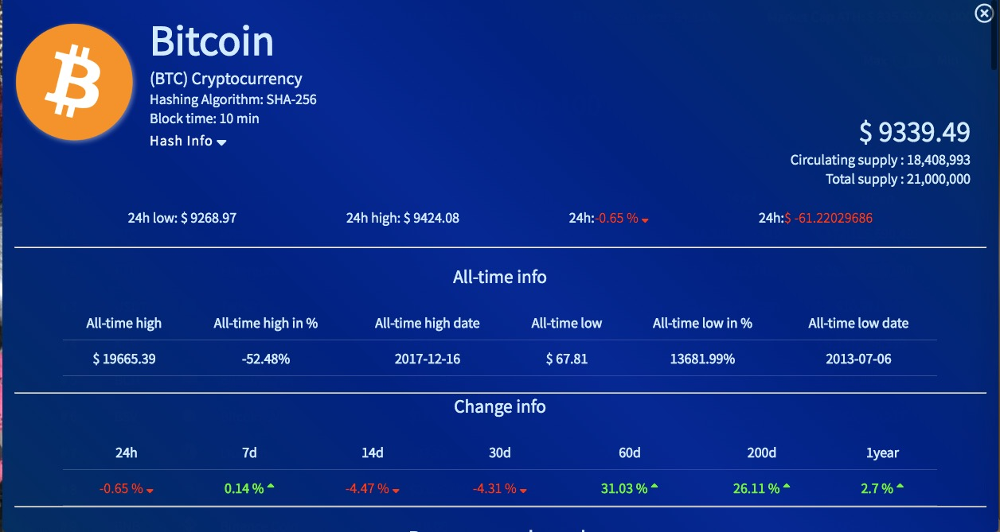
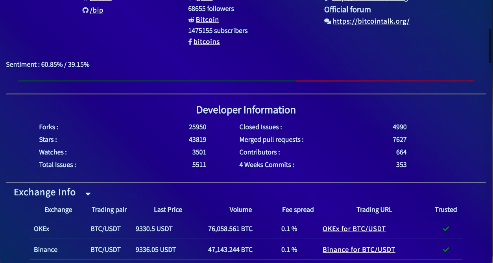

# [Crypto Price Tracker](https://danyweis.com/Project/crypto/index.html)

This is a Crypto Price Tracker page with minimal information (_Just the Price and the percentage of the last hour_), but you have the choice to see all the details about the top 100 coins.

In this project I worked with the following API's:

- [CoinGecko API](https://www.coingecko.com/api/documentations/v3#/)
- [Coin Paprika API](https://coinpaprika.com/api/)
- [Bitcoinchain API](https://bitcoinchain.com/api#api_market_data)

This is the same time the project I tried to build with [Vue.js](https://github.com/vuejs/vue)

### Minimal Information

### Information lit most Crypto Price Trackers

### Info about selected Coin

### Info about exchanges related to the Coin

